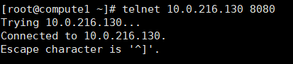

# Linux相关需求解决办法
## 安装VM-tools失败

```shell
# Ubuntu18.04
apt-get install open-vm-tools
apt-get install open-vm-tools-desktop
```

## 启用root权限以及切换root用户

```shell
 sudo passwd root
 su
 # Amazon Linux 2以及某些版本Linux
 sudo passwd
```

## 显示隐藏的目录

```shell
Ctrl+H
```

## 打开终端

```shell
ctrl+alt+t
```

## 解压缩

```bash
# 压缩
tar -zcvf 文件名  
# 解压缩
tar -zxvf 文件名.tar.gz 

# 压缩etc目录到/data路径，压缩名为etc.tar.gz
tar -zcvf /data/etc.tar.gz /etc # 快

tar -Jcvf /data/etc.tar.xz /etc # 慢 压缩比高
-C <PATH>  # 解压到指定路径
-f  # 后面紧跟压缩包
-v  # 解压详情
-x  # 解压缩
-c  # 压缩
-j  # 有gz2属性
-z  # gzip属性的
```

## 运行sh脚本

> cd到目标文件，然后执行 ./*.sh

## 打开root权限的文件管理 

```shell
sudo nautilus
```

## 设置静态IP

**Ubuntu**

```yaml
# Ubuntu 18.04
vim /etc/netplan/XX-installer-config.yaml
# 打开yaml文件，修改文件内容：
# Let NetworkManager manage all devices on this system
network:
  version: 2
  renderer: NetworkManager
  ethernets: 
    ens33:    
      addresses: [192.168.201.131/24]  # 修改静态ip地址
      gateway4: 192.168.201.2    # 网关
      nameservers: 
          addresses: [192.168.201.2]
```

重启应用：

```shell
sudo netplan apply
```

**CentOS**

```shell
# CentOS7.9
vim /etc/sysconfig/network-scripts/ifcfg-ens33
# 修改内容
BOOTPROTO=static
ONBOOT=yes
IPADDR=192.168.201.122 # 静态IP地址
NETMASK=255.255.255.0
GATEWAY=192.168.201.2
DNS1=192.168.201.2
```

重启网络：

```shell
systemctl restart network
```

## 解决虚拟机没网

```shell
# ubuntu18.04
sudo service network-manager stop
sudo rm /var/lib/NetworkManager/NetworkManager.state
sudo service network-manager start
```

```shell
# CentOS7.9
# 没网报错 Failed to start LSB: Bring up/down
systemctl stop NetworkManager
systemctl disable NetworkManager  # 此步骤可省
systemctl start network.service
```


## SSH

### 安装ssh

```shell
# ubuntu18.04
apt-get install openssh-server
```

打开 sshd_config 配置文件,远程连接修改

```shell
vim /etc/ssh/sshd_config 
# 此行取消注释，并改为yes
#PermitRootLogin prohibit-password
PermitRootLogin yes


/etc/init.d/ssh restart #重启SSH服务  
（/etc/init.d/ssh stop #关闭SSH服务）
查看ssh服务：ps -e | grep ssh
```

### 免密登陆

```bash
ssh-keygen -t rsa  # 生成密钥
# ssh-keygen - 生成、管理和转换认证密钥，包括 RSA 和 DSA 两种密钥
# 密钥类型可以用 -t 选项指定。如果没有指定则默认生成用于SSH-2的RSA密钥
ssh-copy-id <target_ip>  # 将公钥复制到目标主机实现免密登陆
```

### 错误解决

>cmd ssh远程连接虚拟机，错误信息：
>
>ECDSA host key for 192.168.201.146 has changed and you have requested strict checking.
>
>解决方法：命令  ssh-keygen -R "你的远程服务器ip地址"   清除缓存秘钥

### 参数选项

```bash
# 连接不进行主机密钥检查
-o StrictHostKeyChecking=no  
-o UserKnownHostsFile=/dev/null
```

## 删除文件夹所有的文件

```shell
rm -f '文件夹'
# 慎用
rm -vf '文件夹'
```

## 查看端口占用

```shell
ss -ntl
netstat -tunlp | grep 端口号
```

## 进程

```bash
# 杀死进程
kill -9 pid
# 0信号查看进程是否存在
killall -0 nginx
```

## 查看是否安装包

```bash
rpm -qi '包名'
```

## RPM使用

```bash
# 选项有 -q -R -i
rpm -q ansible # 查看是否安装ansible
rpm -qi ansible # 查看是否安装ansible并返回软件详细信息
rpm -qR ansible  # 查看安装ansible包所需的依赖
```

## 防火墙&SELinux

### CentOS

```shell
# 关闭防火墙
# CentOS6.7
service iptables stop
chkconfig iptables off
# CentOS7.9
systemctl stop firewalld
systemctl disable firewalld
# 关闭selinux
vim /etc/selinux/config
# 修改内容为
SELINUX=disable
```

### Ubuntu

```shell
systemctl stop firewalld
systemctl disable firewalld
```

## iptables

> 管理防火墙规则
>
> iptables具有Filter，NAT，Mangle，Raw四种内建表

```bash
#iptables -t filter -L  查看filter表
#iptables -t nat  -L    查看nat表
#iptables -t mangel -L 查看mangel表
#iptables -t raw  -L 查看Raw表

# 查看开放的端口
iptables -nL
# 开放8880端口（没有到主机的路由）
iptables -I INPUT -p tcp --dport 8880 -j ACCEPT
# 命令用于将linux内核中的iptables表导出到标准输出设备商，通常，使用shell中I/O重定向功能将其输出保存到指定文件中。
iptables-save 

# 添加端口转发
iptables -t nat -A PREROUTING -p tcp --dport 1000:20000 -j DNAT --to-destination 192.168.201.125
# 将本机1000:20000的端口转发至192.168.201.125

# 本机端口转发
iptables -t nat -I PREROUTING -p tcp --dport 8880 -j REDIRECT --to-ports 8880   # -I插入规则到最前面

# 列出端口转发规则以及序号
iptables -t nat -L -n --line-numbers   # nat表
# 根据序号删除，这里假如它的序号是1
iptables -t nat -D PREROUTING 1   # 删除nat表的PREROUTING链序号为1的规则
```

## Windows本地文件传输到Linux

```shell
# scp命令
scp E:\IDM下载文件\jdk-16.0.1_linux-aarch64_bin.tar.gz root@192.168.201.250:/opt/data
```

## Linux 命令行向文件添加内容

```shell
 # eg： 添加到文件末尾
 echo 192.168.1.21 master >> /etc/hosts
```

## Linux自带python切换

```python
# 进入/usr/bin目录：
[root@ localhost bin]# pwd
/usr/bin
# 将原有python执行程序备份：
[root@ localhost bin]# mv python python-bk
#添加python3.7的软连接：
[root@ localhost bin]# ln -s python3.7 python
# 验证python版本
# 验证python现在的版本：

[root@ localhost bin]# python -V
Python 3.7.2

```

切换python版本yum报错：

> /usr/bin 关于yum的文件进行修改为python3

[ Centos 7 安装 Python3.5.2后yum不能正常使用](https://blog.csdn.net/degrade/article/details/52814296?utm_medium=distribute.pc_relevant.none-task-blog-2~default~BlogCommendFromMachineLearnPai2~default-1.control&depth_1-utm_source=distribute.pc_relevant.none-task-blog-2~default~BlogCommendFromMachineLearnPai2~default-1.control)

## Tmux基本使用

> [Tmux 使用教程 - 阮一峰的网络日志 ](http://www.ruanyifeng.com/blog/2019/10/tmux.html)
>
> 在远程ssh连接的时候防止超时断开进程，使用tmux可以保证

### 安装

```bash
# CentOS/Fedora
$ sudo yum install tmux
# Ubuntu/Debian
$ sudo apt-get install tmux
# Mac
$ brew install tmux
```

### 基本使用

```bash
tmux  # 启动新窗口(会话)
tmux ls  # 查看有哪些窗口
tmux a -t 0   # 进入0号窗口
ctrl+b 松开 按d # 退出tmux
tmux switch -t 1 # 切换窗口   切换到窗口1
tmux kill-session -t 0  # 关闭会话0
tmux rename -t 2 test # tmux列表重命名，方便记忆  将2重命名为test
```

上下滚屏：

```bash
ctrl+b 松开 按"["进入编辑模式，接着按上下键进行上下滚动
退出编辑模式按ESC
# tmux内部切换会话
ctrl+b 松开 按s，选择需要的会话
```

## VIM基本使用

### 清空文件内容

```bash
# vim进入文件，命令行模式键入
gg  # 进入行首
dG  # 清空文件
:wq  # 保存退出
```

### 搜索指定字符串

```bash
/<要搜索的字符串>  # 替换掉<>
# n键跳转到下一个字符串  N跳转上一个字符串
```

### 粘贴文件自动注释

```bash
# 粘贴前执行
:set paste
```

### 删除多行内容

```bash
:3,5d # 删除3-5行内容
```


## 查看动态文本

```bash
tail -f  <path>  # 查看日志有效
```

## sed

```bash
# sed引用变量需要使用单引号套住双引号，在双引号里面写入变量
'"$变量名"'
# sed替换有引号就使用双引号
sed -i '/^123/d' /etc/hosts   # 删除123开头的行
sed -i 's/123/456/g' /etc/hosts # 123替换为456
sed -i '8i aaa' test/yaml   # 在第8行插入aaa字符
sed -i '/localhost/a # CUSTOMIZE END' /etc/hosts  # 选项a： 搜索localhost并在下一行添加 '# CUSTOMIZE END'
# https://www.cnblogs.com/yangsuxia/p/3382410.html  sed空行参考
sed -i '/monitoring:children/{x;p;x;}' /etc/maine/ustack-hosts # 在搜索字符串的上一行添加空行
```

## curl&wget

**curl**

```bash
# 用法
curl [option] [url]
# 选项
# -o  将url下载的文件保存到指定路径文件
curl -o /root/123.txt  http://192.168.201.122/index.html  # 将index.html文件保存到/root/并重命名为123.txt
# -O 将url下载的文件以最后的文件名保存
curl -O http://192.168.201.122/index.html   # 以index.html报存
--silent  # 静默下载，不打印下载信息
# 超时与重试 https://cloud.tencent.com/developer/article/1581200
# 更多待补充
```

**wget**

```bash
# 最常使用 直接wget url 下载文件  偏向于下载文件
wget <url>
-P <path> # 下载到指定目录
```

## shell命令获取IP地址

```bash
# 1
seed_ip=$(ip a | grep ens33 | grep inet | awk '{print $2}' |sed 's/\/.*//')   # ens33为网卡名
# 2
ip=$(ifconfig "ens33" | grep "inet " | cut -f 10 -d " ")
ip=$(ip a | grep eth0 | grep inet | cut -f 6 -d ' ' | cut -f 1 -d '/')
# cut -f 6 -d ' '  以空格分隔返回第六个，后面同理
hostname -I | cut -f 1 -d ' '   # 最简方法
```

## httpd

### httpd修改端口后重启报错

```bash
# 极可能原因是selinux端口标签不存在
semanage port -l               #查看所有端口标签 
semanage port -l | grep 8880   #查看8880端口标签
semanage port -a -t http_port_t -p tcp 8880    # 新增标签
# 增加之后应该就能重启了
```

### httpd web下目录访问报错

> You don’t have permission to access / on this server.

```bash
# 允许用户HHTP访问其家目录，该设定限仅于用户的家目录主页
chcon -R -t httpd_sys_content_t ~user/public_html
```

### httpd开启目录访问

```bash
# 添加下面一行
Options Indexes FollowSymLinks

<Directory />
    Options Indexes FollowSymLinks
	...
</Directory>
```

### httpd目录中文乱码

```bash
# 在/etc/httpd/conf/httpd.conf添加下面一行并重启
IndexOptions Charset=UTF-8
```


## yum&dnf

！**yum**

> [参考](https://blog.csdn.net/fang_a_kai/article/details/83786750)

```bash
yum clean all  # 清空缓存
yum makecache  # 建立缓存
yum repolist all   # 查看可用仓库
# 查看可安装的软件包版本
yum list maine --showduplicates | sort -r # --showduplicates 选项显示具体版本，通过sort 进行排序
# 列出某一仓库中的rpm
yum repo-pkgs <repo-name> list
```

**dnf**

> 用法同yum

#### 查询模块软件流

```bash
dnf module list
dnf module disable nodejs  # 关闭模块软件流
```


## Shell

### 正则匹配

```bash
正则表达式 \w \s \d \b 用法：
. 匹配除换行符以外的任意字符
\w 匹配字母或数字或下划线
\s 匹配任意的空白符
\d 匹配数字                      等价于[0-9]
\D 匹配非数字字符
\b 匹配单词的开始或结束
^ 匹配字符串的开始
$ 匹配字符串的结束
其中，[A-Z]表示除了不包含大写字母，取反;^[A-Z]表示以大写字母开头
```

### 查看服务

```bash
ps -aux
ps -aux|grep httpd  # 会查到此命令的进程
ps -aux|grep -v grep|grep httpd # 会忽略此命令的进程
```

### tee

```bash
# tee指令会从标准输入设备读取数据，将其内容输出到标准输出设备，同时保存成文件。
# eg:
ls xxx 2>&1 | tee test.log   # 将ls报错转成标准输出，并将内容输入到test.log文件中  xxx表示不存在的文件
```

### 更多

```bash
# 此设置可防止屏蔽管道中的错误。如果管道中的任何命令失败，该返回代码将被用作整个管道的返回代码。
set -o pipefail
# 报错中断执行脚本后续
set -o errexit
```

## rz命令

```bash
yum install -y lrzsz
```


## CPU性能测试

测试工具:

>unixbench 
>
>https://github.com/cloudharmony/unixbench

> sysbench 
>
> https://github.com/akopytov/sysbench#linux
>
> https://cloud.tencent.com/developer/article/1468116


## 网络带宽性能测试

>qperf
>
>https://github.com/linux-rdma/qperf/tree/master

> Netperf
>
> https://github.com/HewlettPackard/netperf

## 磁盘性能测试

> fio
>
> https://github.com/axboe/fio

# Linux网络基础

## telnet

### 查看服务器的某个端口是否能够访问

用法：

```bash
telnet <ip> <端口号>
```
示例：
```bash
telnet 10.0.216.130 8080
```

连接成功如图：

